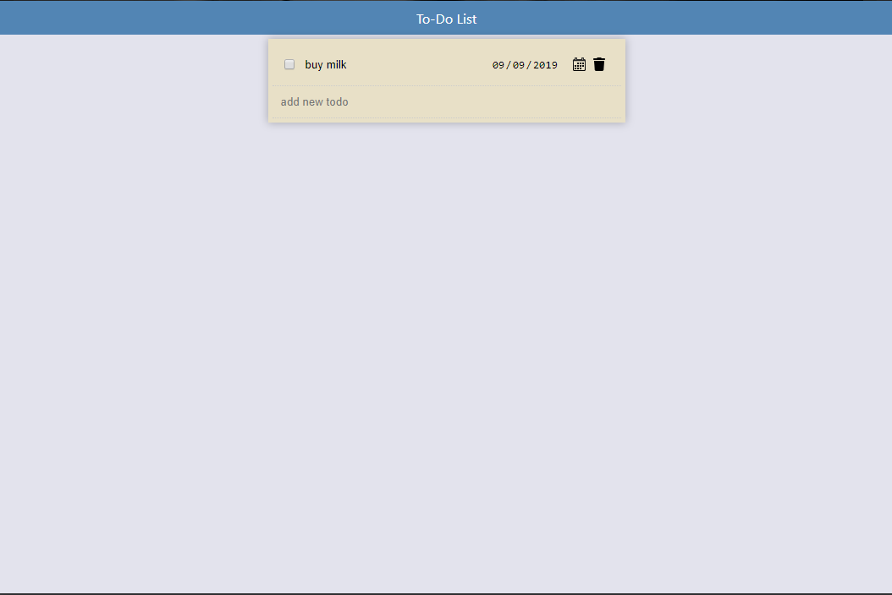

## ToDo

ToDo is an application for add,edit,complete and delete todos.

## Table of contents

> * [ToDo](#ToDo)
>   * [Requirements](#Requirements)
>   * [Installation](#installation)
>   * [Usage](#usage)
>     * [Screenshots](#screenshots)
>   * [Testing](#Testing)
>     * [Cypress](#Cypress)
>     * [Jest](#Jest)
>   * [Build](#build)
>    

## Requirements
To run this application locally, you must have installed into your machine [node.js](https://nodejs.org/en/).

## Installation
To start this application locally, just run `npm start` into the terminal.
Make sure that dependencies has been installed with `npm install` before trying to start the application.

## Usage
When the page first loads, the user will see a empty row that says Add new todo. The user can add a todo either with 
blurring the field or pressing enter. The user can edit the todo simply by clicking on it. The user can add due date to 
todo my clicking the Add DueDate button. The user can complete/un-complete a Todo by checking his checkbox on the left side of todo. 
Last user can delete a todo my hitting the trash icon on the right side of the todo. When the user completes 3 todos, 
a modal appears that congrats the user.

### Screenshots
When the page load first time:

When the user add a todo:

When the user add due date to the todo:

When the user complete a todo:

When the user complete 3 todos:

## Testing

The application uses [cypress](https://www.cypress.io/) for end-to-end test and [jest](https://jestjs.io/) for unit test.

### Cypress
To run the end-to-end tests, run into the console `npm run cypress:open` and on the cypress panel select the `add-todo.spec.js`
and it will run the test automatically. 
> *The application must be running for the tests to begin.*

### Jest
To run the unit tests, run into console `npm run test`.

## Build

To build this application, run `npm run build` into the console and when the build ends, a `build` folder will appear with all the 
static files.

